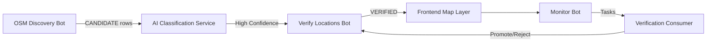

# PROJECT_CORE.md
**Turkish Diaspora App – Master Core Document**  
_Versie 1.0 — gegenereerd op basis van Cursor-onderzoek (canonieke bron)_

---

# 1. 🎯 Mission / Scope

De Turkish Diaspora App is een **AI-gedreven ontdek-, verificatie- en mappingplatform**  
voor Turkse ondernemingen, organisaties en gemeenschapslocaties in Nederland.

Doelen:
- Automatische data pipeline van **discover → classify → verify → map**  
- Gebruik van **OSM** en eigen AI-classificatie  
- **Supabase Postgres** als state machine database  
- **Mapbox frontend** met search, list, overlay dettagli, clustering  
- **Admin Dashboard** voor metrics, workers, jobs en monitoring  
- **Geen handwerk**: alles AI-first, volledig automatisch.

---

# 2. 🧱 Architecture Overview

| Layer | Description | Code | Status |
|------|-------------|------|--------|
| **Frontend** | UI, Map, Search, Admin Panel | `Frontend/src` | Active |
| **Backend API** | `/api/v1/*` endpoints | `Backend/app/api/*` | Active |
| **Services** | AI, DB, OSM, metrics, orchestrator | `Backend/services/*` | Core |
| **Workers** | Bots: discovery, verify, monitor, alert | `Backend/app/workers/*` | Active |
| **Database** | Canonical tables & enums | `Infra/supabase/*.sql` | Stable |
| **Metrics** | Snapshot + worker_health | `metrics_service` + `worker_runs`, `ai_logs` | Active |
| **Docs** | Runbooks, UX docs, QA | `Docs/*.md` | 90% complete |

---

# 3. 🔁 Core Data Flow (System Lifecycle)

---

# 4. 🤖 Workers Overview

| Worker | Goal | Input | Output | DB Touchpoints | Status |
|-------|------|-------|--------|----------------|--------|
| discovery_bot | Nieuwe locaties vinden (OSM) | bbox/grid | → CANDIDATE | `locations`, `overpass_calls` | Production |
| discovery_train_bot | Queue-gebaseerde discovery | `discovery_jobs` | worker_runs | `worker_runs` | NEW |
| verify_locations | AI verificatie & promoties | CANDIDATE rows | VERIFIED / stays | `ai_logs`, `locations` | Stable |
| monitor_bot | Freshness policy → tasks | VERIFIED rows | tasks queue | `tasks`, `worker_runs` | Active |
| verification_consumer | Task uitvoering | tasks | updated states | `tasks`, `locations` | NEW |
| alert_bot | AI/OSM error monitoring | ai_logs | webhook alert | `ai_logs`, `overpass_calls` | Active |
| reclassify_other | Misclassifications fixen | locations | updated category | `locations` | Optional |

---

# 5. 🗄 Database Overview

| Table | Purpose | Key Fields |
|--------|---------|------------|
| `locations` | Core entity + state machine | id, place_id, category, state, confidence |
| `ai_logs` | Audit trail for AI decisions | prompt, response, metadata |
| `worker_runs` | Worker lifecycle & health | bot, status, progress, counters |
| `tasks` | Queue voor verification | type, status, attempts |
| `discovery_jobs` | Queue voor discovery train | city_key, status |
| `overpass_calls` | Telemetry voor OSM usage | endpoint, bbox, raw_preview |
| `training_data` | Gold data voor AI-finetuning | input/output |

---

# 6. 📊 Metrics & Observability

Alle metrics komen samen in:

`metrics_service.generate_metrics_snapshot()`

Gebaseerd op:
- worker_runs  
- ai_logs  
- tasks  
- overpass_calls  

Frontend UI gebruikt `/api/v1/admin/metrics`.

---

# 7. 🧩 Active Epics (Main Pillars)

1. **Data Discovery & Enrichment**
2. **Classification & Verification**
3. **Admin Dashboard & Metrics**
4. **Map UX & Navigation**
5. **Branding & Design System**
6. **Documentation & Developer Experience**

---

# 8. ⚖ Principles (Development & AI Rules)

1. AI mag geen aannames doen → altijd verifieerbare feiten.  
2. Workers moeten idempotent zijn.  
3. Alles produceert metrics of logs.  
4. Documentatie = onderdeel van elke taak.  
5. Geen database schema wijzigingen zonder expliciete goedkeuring.  
6. SOP moet gevolgd worden bij elke wijziging.  
7. Eén change per Work Unit (atomic commits).