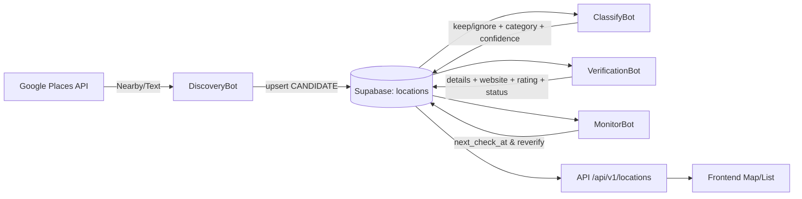
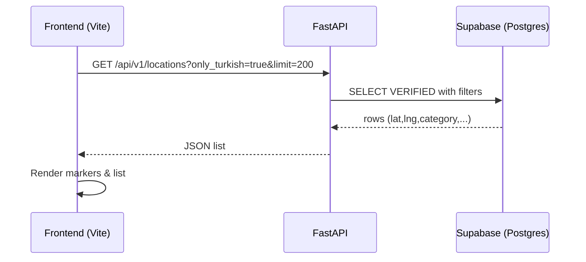

# Turkish Diaspora App — Developer Handbook / Runbook (TDA-110)

> **Epic:** TDA-107 – Consolidatie & Documentatie  
> **Doel:** Nieuwe developers kunnen na het lezen van dit document **binnen één dag** lokaal draaien én de volledige pipeline begrijpen/opereren. fileciteturn0file4

---

## 1) Situatieschets & Scope

De MVP staat, draait stabiel en de autonome datalaag (discovery → classificatie → verificatie → monitoring) werkt end-to-end. Deze runbook beschrijft **setup, workflows, cronjobs en dataflows** zodat iedereen het systeem consistent kan opstarten, beheren en troubleshooten. Het sluit aan op de architectuur en roadmap in *The New Testament* documenten en de reeds opgeleverde stories (o.a. TDA‑7/8/10/11/13/14/16/20). fileciteturn0file2turn0file3turn0file6

**Wat je na dit document kunt:**  
- Lokaal backend + frontend starten en verbinden. fileciteturn0file10  
- Workers/bots draaien (Discovery, Verification, Monitor, Alert) en resultaten controleren. fileciteturn0file12turn0file14turn0file1turn0file17  
- Cronjobs configureren op Render en Supabase koppelen. fileciteturn0file2  
- Begrijpen hoe de data door het systeem stroomt (Mermaid-diagrammen). fileciteturn0file2

---

## 2) Overzicht Architectuur & Repos

**Stack**: FastAPI + Async SQLAlchemy (Supabase Postgres), React (Vite + Tailwind + shadcn/ui), Bots (async workers), OpenAI voor AI-taken, Google Places (legaal) voor discovery. Observability via JSON (structlog) + interne metrics/alerts. fileciteturn0file2turn0file5turn0file17

**Monorepo** (top-level):  
```
turkish-diaspora-app/
├─ Backend/           # FastAPI + workers + services
├─ Frontend/          # React (Vite) + Tailwind + shadcn/ui
├─ Docs/              # dit runbook + architectuur
├─ Infra/             # supabase SQL, render.yaml, config (cities/categories)
└─ .github/workflows/ # CI/CD
```
fileciteturn0file5

---

## 3) Systeemvereisten

- Python 3.11+ met venv
- Node 20+ (Vite) en npm
- Een Supabase project (Postgres) met de tabellen uit `Infra/supabase/*.sql`  
- API keys: **OPENAI_API_KEY**, **GOOGLE_API_KEY** (Places), database **DATABASE_URL**  
- Render account (API + Cron Jobs) voor deploys/workers fileciteturn0file6

---

## 4) Omgevingsvariabelen (.env template)

Maak in **/Backend/.env** (en in Render Secrets) minimaal deze variabelen aan:

```dotenv
# App
APP_ENV=dev
APP_VERSION=0.1.0

# Database (Supabase → Connection string)
DATABASE_URL=postgresql+asyncpg://<user>:<pass>@<host>:5432/<db>

# AI
OPENAI_API_KEY=sk-...
OPENAI_MODEL=gpt-4.1-mini

# Google Places
GOOGLE_API_KEY=...
GOOGLE_PLACES_LANGUAGE=nl
GOOGLE_PLACES_REGION=nl

# Classification defaults
CLASSIFY_MIN_CONF=0.80

# Alerting / Metrics
ALERT_CHECK_INTERVAL_SECONDS=60
ALERT_ERR_RATE_THRESHOLD=0.10
ALERT_GOOGLE429_THRESHOLD=5
ALERT_ERR_RATE_WINDOW_MINUTES=60
ALERT_GOOGLE429_WINDOW_MINUTES=60
# ALERT_WEBHOOK_URL=... (optioneel)
# ALERT_CHANNEL=...    (optioneel)
```
**Frontend** leest de API‑basis uit `Frontend/.env.*` via `VITE_API_BASE_URL`. fileciteturn0file10

> Tip: voeg een centrale `.env.template` toe aan `/Docs/` of `/Infra/` conform *Backlog – C1‑S2*. fileciteturn0file19

---

## 5) Database & Migrations (Supabase)

Voer de SQL-migraties in `Infra/supabase/` uit om de vijf kern-tabellen te maken: `locations, ai_logs, tasks, training_data, category_icon_map`, incl. constraints en indexen (o.a. op `state, category, next_check_at`). Scripts zijn idempotent. fileciteturn0file7

**Sanity checks** (voorbeeld):  
- `SELECT 1;`  
- Alle tabellen/kolommen bestaan (zie TDA‑4 comment). fileciteturn0file7

---

## 6) Lokaal starten (Quickstart)

### Backend
```bash
cd Backend
python -m venv .venv && source .venv/bin/activate
pip install -r requirements.txt  # of uv/pip-tools
uvicorn app.main:app --reload
# Open: http://127.0.0.1:8000/health  → {"status":"ok"}
```
- CORS staat open voor Vite dev.  
- DB‑connectie logt start‑check (“Database connection OK.”). fileciteturn0file9turn0file10

### Frontend
```bash
cd Frontend
npm install
cp .env.development.example .env.development  # indien aanwezig
# zet VITE_API_BASE_URL=http://127.0.0.1:8000
npm run dev
# Open: http://localhost:5173
```
- `npm run build` levert productie‑build zonder errors. fileciteturn0file10

---

## 7) Workers & Cronjobs

### Beschikbare bots (workers)
- **DiscoveryBot** — grid‑based Google Places → schrijft CANDIDATE. fileciteturn0file12  
- **VerificationBot** — verrijkt Place Details, promoot naar VERIFIED/SUSPENDED. fileciteturn0file6  
- **ClassifyBot** — AI keep/ignore + category + confidence (gold‑evaluatie mogelijk). fileciteturn0file14  
- **MonitorBot** — bewaakt freshness en triggert her‑verificatie (≤ 90 dagen). fileciteturn0file1  
- **AlertBot** — monitort KPI’s en triggert alerts (foutspikes, 429 bursts). fileciteturn0file17

### Handmatig draaien (voorbeelden)

**Discovery (Rotterdam, 3 categorieën):**
```bash
cd Backend && source .venv/bin/activate
python -m app.workers.discovery_bot \
  --city rotterdam \
  --categories bakery,restaurant,supermarket \
  --nearby-radius-m 1000 \
  --grid-span-km 12 \
  --max-per-cell-per-category 20 \
  --inter-call-sleep-s 0.15
# Resultaat: >500 CANDIDATE, dedupe op place_id
```
fileciteturn0file12

**Classify demo / batch:**
```bash
# demo
curl 'http://127.0.0.1:8000/dev/ai/ping'
curl 'http://127.0.0.1:8000/dev/ai/classify-demo?...'
# batch (dry run / met drempel)
python -m app.workers.classify_bot --limit 50 --min-confidence 0.80 --dry-run
python -m app.workers.classify_bot --limit 200 --min-confidence 0.80
```
fileciteturn0file13turn0file14

**Monitor (freshness loop):**
```bash
python -m app.workers.monitor_bot --limit 200 --dry-run
# Doel: geen active records ouder dan 90 dagen zonder next_check_at
```
fileciteturn0file1

**Alerts (KPI/429 spikes):**
```bash
python -m app.workers.alert_bot
# thresholds via env (zie §4)
```
fileciteturn0file17

### Render Cron (voorbeeldschema’s)

> Render Cron gebruikt standaard crontab‑syntaxis. Stel per job de **Command**, **Schedule** en **Environment** in (secrets).

| Job | Schedule | Command (voorbeeld) |
| --- | --- | --- |
| Discovery (wekelijkse batch) | `0 6 * * 6` | `python -m app.workers.discovery_bot --city rotterdam --categories bakery,restaurant,supermarket --grid-span-km 12 --nearby-radius-m 1000 --max-per-cell-per-category 20 --max-total-inserts 1500` |
| Classify (dagelijks) | `0 */6 * * *` | `python -m app.workers.classify_bot --limit 500 --min-confidence 0.80` |
| Verification (dagelijks) | `15 */6 * * *` | `python -m app.workers.verification_bot --limit 300` |
| Monitor (uurlijks) | `*/60 * * * *` | `python -m app.workers.monitor_bot --limit 200` |
| Alerts (iedere 1–5 min) | `*/5 * * * *` | `python -m app.workers.alert_bot` |

> Pas de frequentie aan op quota/kosten (zie *Cost Control*). fileciteturn0file2

---

## 8) API Endpoints (kern)

- `GET /health`, `GET /version` — monitoring. fileciteturn0file9  
- `GET /api/v1/locations` — VERIFIED (met filters), ondersteunt `only_turkish=true` & `min_confidence`. fileciteturn0file15turn0file16  
- `GET /dev/google/text`, `GET /dev/google/nearby` — dev‑endpoints voor Places. fileciteturn0file11  
- `POST /dev/ai/classify-apply?id=...` — schrijft AI‑resultaat naar DB. fileciteturn0file14

---

## 9) Dataflows (Mermaid)

### 9.1 End‑to‑End (Discovery → Frontend)


fileciteturn0file6turn0file12turn0file14turn0file1

### 9.2 Request Lifecycle (Frontend ↔ Backend)


fileciteturn0file15turn0file16

### 9.3 Observability & Alerts

```mermaid
flowchart TD
  L[API & Bots] -->|structlog JSON| A[ai_logs / metrics service]
  A --> M[Metrics Snapshot (JSON)]
  M --> AL[AlertBot]
  AL -->|thresholds| N{Trigger?}
  N -->|yes| OUT[Log/Webhook Alert]
  N -->|no| M
```
fileciteturn0file17

---

## 10) Operaties & Routine Taken

- **Sanity check nieuwste PENDING_VERIFICATION** (mini-job): script in TDA‑11 comment. fileciteturn0file14  
- **Batch promote volume**: verlaag tijdelijk `--min-confidence` (bijv. 0.75) en draai grotere batch, daarna terugzetten. fileciteturn0file16  
- **Freshness audit**: na `monitor_bot` run moet *geen* actief record >90 dagen vervallen zijn. fileciteturn0file1

---

## 11) Troubleshooting

**Geen e‑mails/API keys op frontend**  
- Vite expose’t alleen `VITE_*`. Backend‑secrets nooit in frontend bundelen. fileciteturn0file6

**DB SSL errors (dev)**  
- Gebruik asyncpg met `ssl.SSLContext` in dev; prod = verified. Zie TDA‑5 notities. fileciteturn0file10

**429 / quota exceeded**  
- Backoff + jitter zit in google_service, maar verlaag inter‑call sleep en batch caps. Zet Alert thresholds aan. fileciteturn0file11turn0file17

**Lege kaart/lijst (Turks‑filter)**  
- Eerst batch classificeren/promoten zodat `only_turkish=true` >0 resultaten geeft. fileciteturn0file16

**JSON‑validatie AI**  
- OpenAIService valideert met Pydantic v2 + retries. Check `ai_logs` bij failures. fileciteturn0file13

**MonitorBot lijkt niets te doen**  
- Controleer `next_check_at` regels; terminal states (RETIRED/SUSPENDED) zijn uitgesloten. fileciteturn0file1

---

## 12) Cost Control & Policies

- Field Masks gebruiken bij Google Places; limieten op batchgrootte; caching waar zinvol. fileciteturn0file2  
- AI: compacte prompts, kost‑efficiënte modellen (`gpt-4.1-mini`) en retries begrenzen. fileciteturn0file6  
- Freshness policy cap op 90 dagen. fileciteturn0file5

---

## 13) Appendix — Referenties

- **Architectuur & Roadmap**: *The New Testament* / *New Testament II (+Backlog)*. fileciteturn0file2turn0file3turn0file4  
- **Discovery service (Google Places)**: TDA‑7. fileciteturn0file11  
- **DiscoveryBot**: TDA‑8. fileciteturn0file12  
- **OpenAI service**: TDA‑10. fileciteturn0file13  
- **Classification**: TDA‑11. fileciteturn0file14  
- **Map API + Locations router**: TDA‑13. fileciteturn0file15  
- **Only Turkish filter**: TDA‑14. fileciteturn0file16  
- **MonitorBot**: TDA‑16. fileciteturn0file1  
- **Metrics/Alerts**: TDA‑20. fileciteturn0file17

---

## 14) Final Review Checklist (DoD & Acceptance)

**Runbook beschrijft setup & workflow volledig?**  
- [ ] Lokaal starten Backend/Frontend gedekt  
- [ ] Env vars / .env template gedocumenteerd  
- [ ] Supabase migraties + sanity checks beschreven  
- [ ] Workers/bots + CLI voorbeelden + cron schema’s opgenomen  
- [ ] Kern‑endpoints en filters (incl. only_turkish) gedocumenteerd  
- [ ] Dataflows met Mermaid aanwezig  
- [ ] Troubleshooting en cost‑policies toegevoegd

**Nieuwe developer kan na lezen alles starten?**  
- [ ] Ja — volg §6 Quickstart en draai §7 Workers  
- [ ] Ja — data zichtbaar in Frontend (markers/list)  
- [ ] Ja — Monitor/Alerts operationeel met defaults

> **Klaar met TDA‑110** zodra alle checkboxen aantoonbaar “true” zijn (screens/logs).

